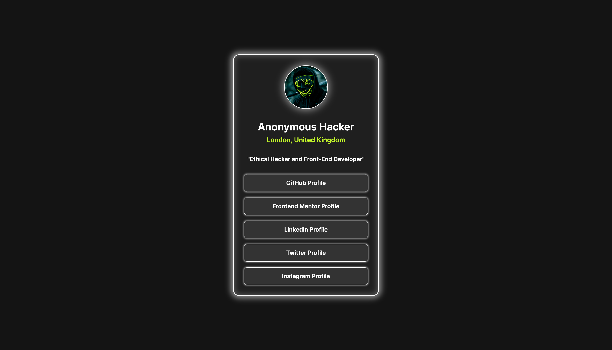

# Frontend Mentor - Social links profile solution

This is a solution to the [Social links profile challenge on Frontend Mentor](https://www.frontendmentor.io/challenges/social-links-profile-UG32l9m6dQ). Frontend Mentor challenges help you improve your coding skills by building realistic projects. 

Link to Figma Design of this project:
[Figma Link](https://www.figma.com/design/ErsS87YeF9ugIagsR1GKnS/FEM---Social-Links-Profile?node-id=0-1&t=CDbU9djfirvRUvbd-1)

## Table of contents

- [Overview](#overview)
  - [The challenge](#the-challenge)
  - [Screenshot](#screenshot)
  - [Links](#links)
- [My process](#my-process)
  - [Built with](#built-with)

**Note: Delete this note and update the table of contents based on what sections you keep.**

## Overview

### The challenge

Users should be able to:

- See hover and focus states for all interactive elements on the page

### Screenshot

### Links

- Solution URL: [GitHub URL](https://github.com/Arshad-Suhale/Social_Links_Profile_Main)
- Live Site URL: [live site URL](https://arshad-suhale.github.io/Social_Links_Profile_Main/)

## My process

### Built with

- Semantic HTML5 markup
- CSS custom properties
- Flexbox
- CSS Grid
- Mobile-first workflow
